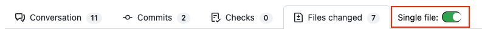
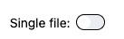

# GitHub Single File Viewer

  
  
  

  

- [Description](#description)
- [Features](#features)
- [Supported Browsers](#supported-browsers)
- [Quick Start](#quick-start)
  * [1. Load the Extension](#1-load-the-extension)
  * [2. Open a PR](#2-open-a-pr)
  * [3. Toggle View](#3-toggle-view)
- [Visual Preview](#visual-preview)
  * [Toggle Location in PR Toolbar](#toggle-location-in-pr-toolbar)
    + [Light mode](#light-mode)
    + [Dark mode](#dark-mode)
  * [Single File Mode ON](#single-file-mode-on)
  * [Single File Mode OFF](#single-file-mode-off)
  * [Animated Toggle](#animated-toggle)
- [Usage Notes](#usage-notes)
- [Known Limitations](#known-limitations)
- [Development](#development)
- [Contributing](#contributing)

## Description
The **GitHub Single File Viewer** is a Chrome/Edge extension that enhances GitHub Pull Request “Files changed” pages by showing **only one file at a time**.

It provides a clean, lightweight toggle for switching between **single-file** and **full-file view**, letting you focus on the files that matter most while reviewing PRs.

---

## Features
- **Single-file toggle:** Focus on one file at a time.
- **Hash-aware navigation:** Automatically scrolls to the file in the URL hash.
- **Theme-aware:** Compatible with GitHub Light and Dark modes.
- **Persistent state:** Remembers your ON/OFF preference across PRs.
- **Robust SPA handling:** Survives GitHub’s multi-pass re-rendering.
- **Lightweight:** Minimal impact on page performance.

---
## Supported Browsers

🟢 Chrome 🟢 Edge 🟢 Firefox

## Quick Start

### 1. Download extension folder
- Download the GitHub repo as a ZIP file or clone the repo using git.

### 2. Load the Extension
#### For Chrome/Edge or any Chromium browser
- Open `chrome://extensions/` or `edge://extensions/` or however extensions are loaded in your browser.
- Enable **Developer mode**, if needed.
- Click **Load unpacked** and select this extension folder.

#### For Firefox
- Open `about:debugging#/runtime/this-firefox`.
- Click on **Load Temporary Add-on**.
- Select `manifest.json` file from the extension folder.

### 3. Open a PR
- Navigate to the **Files changed** tab of any PR.
- The single-file toggle will automatically appear in the PR toolbar.

### 4. Toggle View
- **Click the toggle** to switch ON/OFF between single-file and full-file view.
- Preference is stored automatically in **localStorage**.

---

## Visual Preview

### Toggle Location in PR Toolbar

#### Light mode

#### Dark mode

### Single File Mode ON

### Single File Mode OFF

### Animated Toggle

---

## Usage Notes
- The toggle appears automatically for PR pages under `/pull/`.
- Works for both **full page loads** and **SPA navigation** between PRs.
- Does **not modify GitHub files** — only controls browser visibility.

---

## Known limitations
- It does not work correctly when logged out of Github account. There is no plan to support unauthenticated mode for now.
- When Chrome extension is loaded, there is a warning: `'background.scripts' requires manifest version of 2 or lower.`.
  - This is expected since Chrome uses manifest v3 style where Firefox is still v2 style manifest-based.
  - This is just a warning and does not break any functionality for the extension in Chrome.

---

## Development
- **File structure:**
  - `background.js` – Detects PR pages and injects `mainScript.js`
  - `mainScript.js` – Contains toggle logic and single-file view handling
- **Testing changes:**
  1. Edit `mainScript.js`
  2. Reload the extension in Chrome/Edge
  3. Open or refresh a PR to see updates

---

## Contributing
- Contributions and bug reports are welcome.
- Submit a PR or open an issue describing your feature request or bug.
